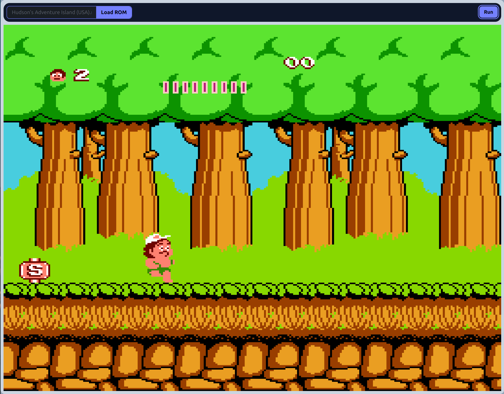

# wasm-nes

## Overview

Wasm NES is a NES emulator compiled to WebAssembly. It is developed with emscripten and emscripten SDL2 port.



### Supported games

Various cartridges contained different integrated circuits that extended capabilities of the NES.
Most commonly these ICs enabled the game to use more ROM/RAM memory than it was accessible by the NES buses alone.

These ICs needs to be emulated in order to support the games that were using them. Different kinds of circuit boards incorporated by the cartridges are called [Mappers](https://www.nesdev.org/wiki/Mapper).
See the list below for the current status of implementation of the mappers, to see if the game you wish to run is supported.

| Mapper ID | Mapper name | Games                                                |
|-----------|-------------|------------------------------------------------------|
| 0         | NROM        | [57 Games](https://nescartdb.com/search/advanced?region_op=equal&region=USA&system_op=equal&system=NTSC&ines_op=equal&ines=0&page=1) |
| 1         | SNROM       | [224 Games](https://nescartdb.com/search/advanced?region_op=equal&region=USA&system_op=equal&system=NTSC&ines_op=equal&ines=1&page=1) |
| 2         | UNROM       | [94 Games](https://nescartdb.com/search/advanced?region_op=equal&region=USA&system_op=equal&system=NTSC&ines_op=equal&ines=2&page=1) |
| 3         | CNROM       | [62 Games](https://nescartdb.com/search/advanced?region_op=equal&region=USA&system_op=equal&system=NTSC&ines_op=equal&ines=3&page=1) |
| 7         | ANROM       | [31 Games](https://nescartdb.com/search/advanced?region_op=equal&region=USA&system_op=equal&system=NTSC&ines_op=equal&ines=7&page=1) |

### Known issues

[Bugs](https://github.com/irdcat/wasm-nes/issues?q=is%3Aissue+is%3Aopen+label%3Abug)<br>
[Open tasks](https://github.com/irdcat/wasm-nes/issues?q=is%3Aissue+is%3Aopen+label%3Aenhancement)

### Controls

Controls are not customizable yet, and only Player 1 controls are hardcoded.

| NES button | Keyboard button |
|------------|-----------------|
| Select     | Space           |
| Start      | Enter           |
| A          | Z               |
| B          | X               |
| Up         | ↑               |
| Down       | ↓               |
| Left       | ←               |
| Right      | →               |

## Local development

### Prerequisites

- [emscripten](https://emscripten.org/docs/getting_started/downloads.html)
- [node](https://nodejs.org/en/download)
- make
- [cmake](https://cmake.org/)

### Running locally

In order to run the application locally, application must be hosted on a server, because browsers are forbidding loading WASM files from the disk.

#### Install http-server from npm

In this document, tool used to host files on a local server is a **http-server** from NPM.

```
npm install -g http-server
```

#### Build the emulator

Scripts included in the project handle things like building C++ sources into binaries and handling NPM dependencies (like TailwindCSS used in the project). After building, all of the required files are put in the `./build` directory.

```
./build.sh
```

#### Serve build files on a local server

Command below serves directory with built files at port 8080

```
http-server ./build -p8080 -c-1
```

#### Open application in web browser

Open *localhost:8080* in web browser

### Running tests

Tests uses core modules of the emulator as a library that is linked to test executable. This project is using [GoogleTest](https://google.github.io/googletest/) framework to run tests.

Test are compiled to WASM and are meant to run on node. Scripts included in the project cover all of the setup required to build and run the tests.

#### Build tests

```
./build-tests.sh
```

#### Run tests

```
./run-tests.sh
```
